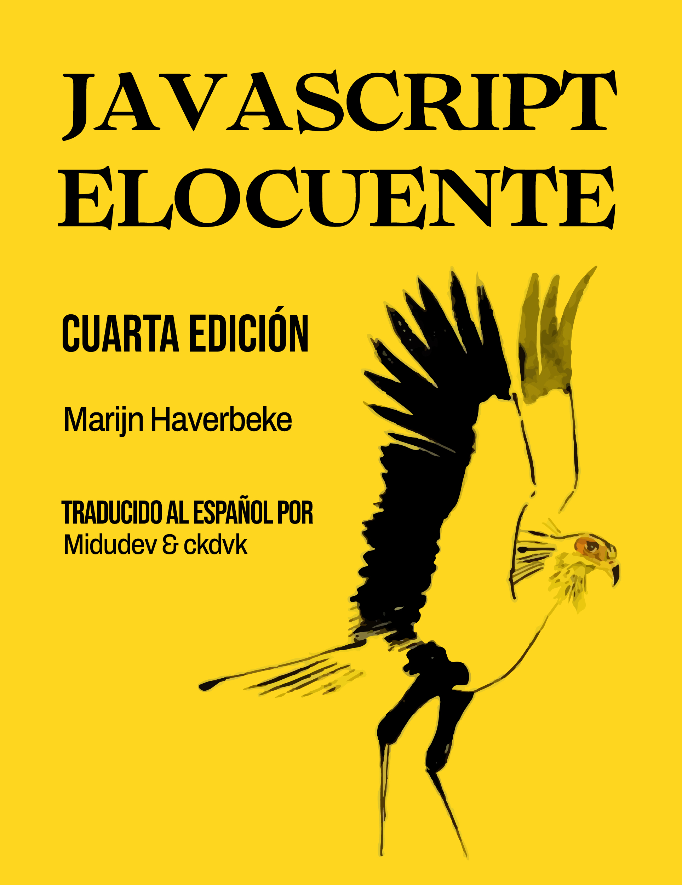

# Eloquent JavaScript en Español

Traducción de la cuarta edición de [Eloquent JavaScript](https://eloquentjavascript.net/) al español por [midudev](https://twitch.tv/midudev). Modificaciones por [ckdvk](https://github.com/ckdvk) para una lectura más natural.

[Repositorio original](https://github.com/marijnh/Eloquent-JavaScript)

<ul>
<li><a href="https://pub-97d2f14809854ff1870055724c829992.r2.dev/book.pdf">Descargar PDF del libro</a> (&amp; <a href="https://pub-97d2f14809854ff1870055724c829992.r2.dev/book_mobile.pdf">Descargar versión pequeña para
  móviles</a>)</li>
<li><a href="https://pub-97d2f14809854ff1870055724c829992.r2.dev/book.epub">Descargar archivo EPUB</a>
</li>
<li><a href="https://pub-97d2f14809854ff1870055724c829992.r2.dev/book.mobi">Descargar archivo MOBI
  (Kindle)</a>
</li>
</ul>
  
## ¿Encontraste un error? ¡Colabora!

**¡No edites los archivos HTML! Estos se generan automáticamente a partir de los archivos Markdown.**

1. Haz un fork de este repositorio.
2. Clona el repositorio en tu máquina local.
3. Edita los archivos Markdown con tu editor de texto favorito.

## Atribución

Este libro trata de JavaScript, programación y los maravillosos mundos digitales. Puedes leerlo online aquí, o
  comprar tu propia <a href="https://nostarch.com/ejs3">copia en papel</a> (3ª edición y en inglés).

Escrito por Marijn Haverbeke.

  
Licenciado bajo
    una <a href="https://creativecommons.org/licenses/by-nc/3.0/">Licencia de Atribución-NoComercial de Creative
      Commons</a>. Todo el código en este libro
    puede también considerarse licenciado bajo
    una <a href="https://eloquentjavascript.net/code/LICENSE">licencia MIT</a>.
  

  
Ilustraciones de varios artistas: Portada
    por <a href="http://www.pechane.com/">Péchane Sumi-e</a>. Ilustraciones de capítulos por <a href="http://madalinatantareanu.com/">Madalina
      Tantareanu</a>. Arte pixel en los Capítulos 7 y 16 por Antonio Perdomo
    Pastor. Diagramas de expresiones regulares en el Capítulo 9 generados
    con <a href="https://regexper.com">regexper.com</a> por Jeff
    Avallone. Fotografía del pueblo en el Capítulo 11 por Fabrice Creuzot. Concepto de juego para el Capítulo 16
    por <a href="http://lessmilk.com">Thomas
      Palef</a>.

